# Poopin Frogs
 This README.MD is under development,stay tuned

# Editing the World.

  The world is finite in size,I will add a menu in the  future to change its size

  You can place blocks and things in the world(**YOU MIGHT WANT TO PRESS `I` TO TURN INVISIBLE SO ENEMIES DONT ATTACK YOU**).
  
  Its like classic minecaft but with poop.
   
## Things edit menu(Press `t`).
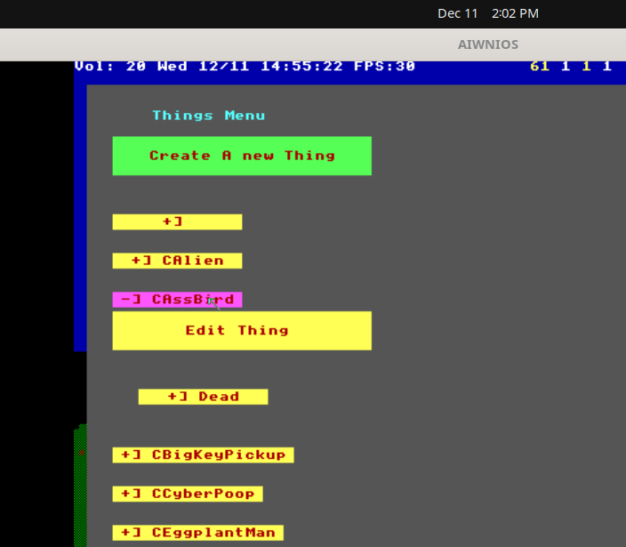

  From here you can make new things(`Green button`).
  
  You can edit things. **USE  '/' IN THE THING NAMES TO MAKE "states" FOR THE THINGS**
  You get edit the graphics from the things menu.

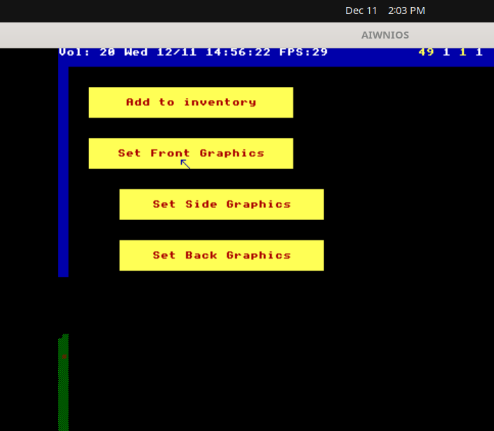

## Doors Edit Menu(Press `Shift+d`)


  Doors do what you think they do. They have various properties. Doors will open if you walk into them unless they need a key or have a tag number that isnt 0.

 ### Door Properties
  - Tag Number
	  - When all enemies of a certian tag die,then the door opens.
 - Small Key
	 - Will open if you have a small key
- Big Key
	 - Will open if you have a big key
- Height
	- How tall the door is
	- 
## Block Edit Shell(Press `b`)

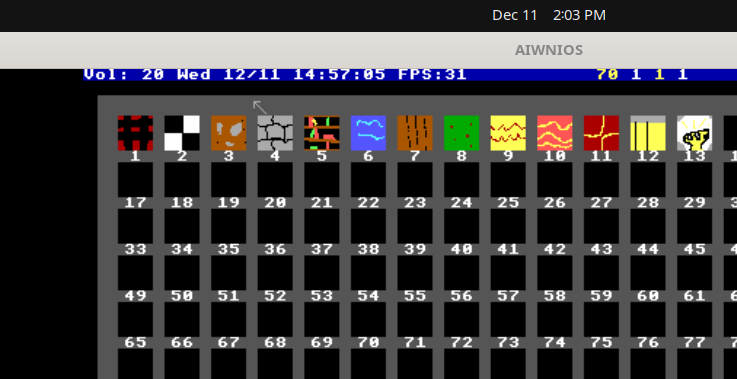

This will open a grid,press an item on the grid to edit the block's textures.

Current properties are hard coded. Ask nrootconauto to easily change this(so you can make lights and liquid blocks).

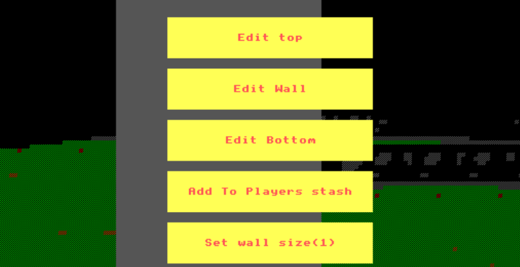

## Poopidex(Press `p`). 

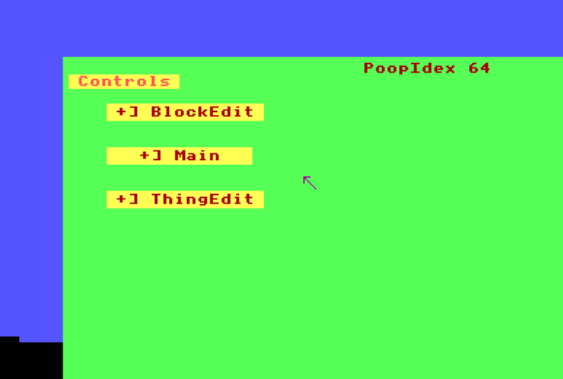

This is a "dictionary" of stuff. You probably wont need this for now.

## Magic Wand(Select from inventory).

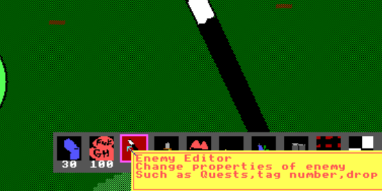

Select the wand,then use it on a thing(click the thing)

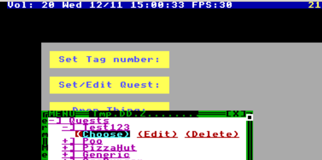

This will let you these properties on a thing
- Tag Number
- Quest	
- And dropped item(when killed). 

# Making images/textures for FrogsEngine
Run `TextureEditor.HC`.

[Editing a Texture in FrogsEngine](https://aiwnios.com/ViewVideo.HC?view=FrogsEngine/EditTexture.DD)

## Texture editor controls
 - File
   - `Ctrl+O` For opening a file
   - `Ctrl+A` For save as
   - `Ctrl+Z` Undo
 - Tools
   - `p` Paint
   - `c` Select Color
   - `l` Line
   - `Shift+P` PolyLine
   - `t` Set Thickness
   - `Shift+B` Set Bounds(Resize image)
   - `E` Ellipse
   - `Ctrl+C` Copy
   - `Ctrl+X` Cut
   - `Ctrl+V` Paste
 - Animation
   - `f` Select Frame
   - `d` delete current frame
   - `s` Set Animation speed

# Writing SmallTalk80-like(PoopTalk) Code.
  
  FrogsEngine uses a SmallTalk-80 like langauge(See `SmallTalk/Interpreter.HC`).
  
  The source code for the SmallTalk stuff should be easy enough to understand.
  
  Pooptalk is strongly typed sort of. You can assign types like this:

  ```
  someMethod: x* ->CFrogNum
  |
    local=CFrogStr
  |
    '-> means return type(above)'.
    '* means any type'.
    
    local _ 'abc' .
    ^ x + 2
  ```
  
## Mini PoopTalk Tutorial

  First open the editor in `SmallTalk/Studio.HC`.
  
  You'll get a sexy class editor,exit it(`Shift+Escape`) and type `STRepl;` and I will show you how to use pooptalk
  
### Logging to console(Aiwnios).
  `show` doesnt log to screen,it logs to the console output
  
  So if you type:
  ```
  #(1 2 3) printString show
  ```
  You should see this in the console window
  ```
  '#(1 2 3 )'
  ```
### Here is a Sexy Syntax guide

  ```
  'Comment(Just a string literal)'.
  
  'Symbols act a global vars'.
  
  #global_var _ 'abc' .
  #global_var show . 'Show the value of the global'.
  (#global_var size + 2) show . 'Add 2 to size and show'.

  'Array'.
  #(1 2 3) do:[:x=CFrogNum| x show ].
  'Nested array(needs # unlike regular smalltalk)'.
  #(#(1 2 3) #(4 5 6) #(7 8 9)) printString show.
  
  'Member access' .
  #thing _ C3DThing new.
  #thing->x _ 123 .
  #thing->x show .
  ```
  PoopTalk lets you access class members via `var->member`.

# Tutorials
## Making a new enemy.

First make a new SmallTalk class by running `Studio.HC`.

Press the `New Class` button

!(Tutorials/NewClass.png)

SmallTalk classes are actually HolyC classes,be sure to have the base class of `C3DThing`.
```c
class CSmallPig:C3DThing {
  CFrogRandom *random_generator;
  F64 speed;
  C3DThing *target;
  F64 state_start_tS;
  F64 state_duration;
  F64 steps_to_walk;
  CFrogStr *state;
};
```


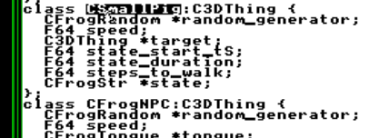

Now make an init method

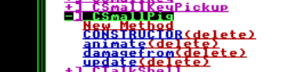

Put this in the file:
```
init->CSmallPig | |
  #world addThing: self .
  template _ #world getThingTemplate: 'CSmallPig' .
  state_start_tS _ CFrogTime now asSeconds .
  state _ 'Normal' .
  random_generator _ CFrogRandom new .
  health _ 25 .
  no_fall_off_edge _ 1 .
  ^ self
```

The `template` member has the current World template. You'll have to make this within the game itself.

Run `3D.HC` and press `t` for a things menu.

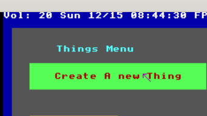

Enter the name:

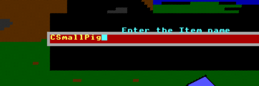

Then edit the Front/Side/Back graphics with the buttons.

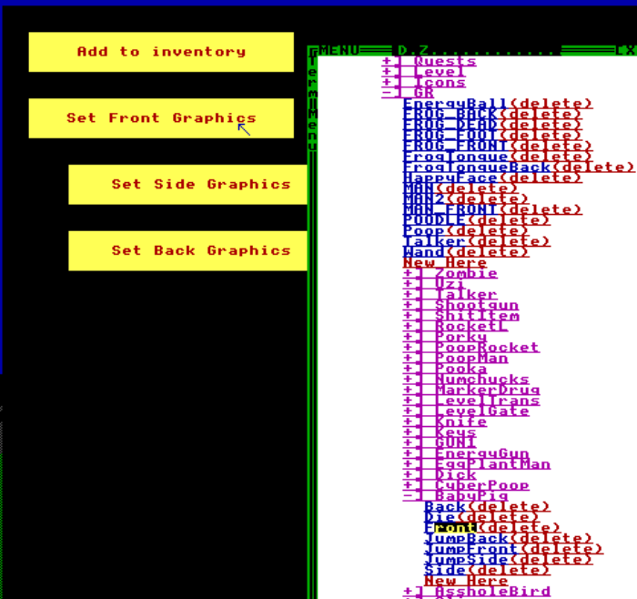

**BE SURE TO MAKE THESE TEMPLATES ALSO**
Use a slash in the name to make a subcategory.
- CSmallPig
   - CSmallPig/Jump
   - CSmallPig/Dead

Now make these methods:

- `update` (Called 10 times per second)
- `animate` (Called every frame boi)
- `damage:` Damage the enemy
- `damage:from:` Damage from a certian dude.
- `init` Add to the world and set health and initial state

### init
```
init->CSmallPig | |
  #world addThing: self .
  template _ #world getThingTemplate: 'CSmallPig' .
  state_start_tS _ CFrogTime now asSeconds .
  state _ 'Normal' .
  random_generator _ CFrogRandom new .
  health _ 25 .
  no_fall_off_edge _ 1 .
  ^ self
```

### animate

This is called every frame,if we jump we check for radius and damage non-pigs
```
animate->*
|
  in_rad=CFrogArray
|
  state = 'Jump' ifTrue: [
    in_rad _ #world getThingsInRadiusFromX: x fromY: y withRadius: 1.5 * 128 .
    in_rad do:[:t=C3DThing|
      'Dont damage other pigs' .
      (t hasClass: CSmallPig) ifFalse: [
        (t ~= self and: t->health > 0) ifTrue: [
          state _ 'Normal' .
          t damage: 10 + (random_generator next * 15) from: self .
        ].
      ] .
    ] .
  ].
```

### update

```
update->* |
  w=C3DWorldManager
  p=CPlayer
  hit_wall=CFrogNum
  rocket=CPoopRocket
  dist=CFrogNum
  tS=CFrogNum
  dist=CFrogNum
  force=CFrogNum
  angle2=CFrogNum

  in_rad=CFrogArray
|
  tS _ CFrogTime now asSeconds.
  w _ #world .

  health <= 0 ifTrue: [
    state ~= 'Dead' ifTrue: [
      w noiseSoundForTime: 500 withMin: 30 withMax: 70 .
      momx2 _ 0 .
      momy2 _ 0 .
      state _ 'Dead' .
      template _ w getThingTemplate: 'CSmallPig/Dead' .
      self die .
      animation_no_repeat _ 1 .
      animation_start_tS _ tS .
    ] .
    ^ 0 . 
  ] .

  ((state = 'Jump') and: self isOnGround) ifTrue: [
    state _ 'Normal' .
  ] .


  state = 'Normal' ifTrue: [
    steps_to_walk _  steps_to_walk - 1 .
    speed _ 70 / 10 *  3.4 .
    template _ w getThingTemplate: 'CSmallPig' .
    animation_no_repeat _ 0 .

    (target hasClass: C3DThing) ifTrue: [
      (target->health <= 0) ifTrue: [
        p _ self lookForTarget .
        (self canSeeThing: p) ifTrue: [
          target _ p.
        ]
      ] .
    ] ifFalse: [
      p _ self lookForTarget .
      (self canSeeThing: p) ifTrue: [
        target _ p.
      ]
    ] .

    'Only walk around if target is defined'.
    ((target hasClass:C3DThing) and: target->health >0) ifTrue: [
      self wander: speed withJumpVelocity: .55 withTarget: target .
      dist _ ((target->x - x) squared + (target->y - y) squared ) sqrt .
      (10*128) >= dist  ifTrue: [
        ((steps_to_walk <= 0 or: random_generator next < .45 ) and: (self canSeeThing: target)) ifTrue: [
          state _ 'Jump' .
          w sweepSoundForTime: 500 withMin: 50 withMax: 70 .
          template _ w getThingTemplate: 'CSmallPig/Jump' .
          angle _ (target->x - x) arg: (target->y - y) .
          force _ 3 * 128 / 30  .
          angle2 _ dist arg: 128 * (target->z - z + .5 ).
          
          momx _ force * angle cos * angle2 cos .
          momy _ force * angle sin * angle2 cos .
          momz _ momz + (force * angle2 sin / 512) + .55 max: .55 . 
        ] .
      ].
    ] .
    steps_to_walk < 0 ifTrue: [
      steps_to_walk _ random_generator next * 10 * 1.3 .
    ] .
  ] .
```

### damage:from:

Sets the target to who damaged the pig.

```
damage: d=CFrgoNum from: f=C3DThing
->*
|
|
  1 to: d / 6 + 4 do:[ 
    #world newParticleAtX: x atY: y atZ: z + .5 withSpread: 64 withColor: #color_RED 
  ] .

  health _ health - d .
  target _ f .
  self update .
```
