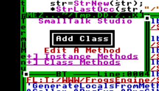
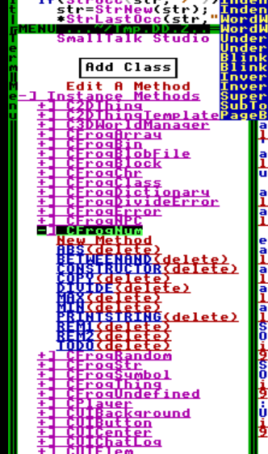

# Poopin Frogs
Welcome to the mother[redacted for GH]ing pooping frogs repo. Here you will learn to use the engine. It currently has a Smalltalk-80 scripting engine,3D ray caster engine and UI code along with tooling like a level and texture editor. I will make little distinction between the internals of each part and the tool usage because if you are actually intrested in contributing to the project you will want both
## SmallTalk80 Compiler
SmallTalk80 is a sexy language. I will use it to support "transparent" calls to objects over the network in the future. It is a compiler that compiles to HolyC because I am too lazy to write another "proper" compiler and I think it is ok for maintainability

### Part 1: The Lexer
The SmallTalk 80 lexer is cool and operatess like TempleOS's lexer to some degree. The main secret-sauce is in `Lex` which is a gaint state machine. The lexer can put back a charactor with the `LEXf_USE_LAST_CHAR␅` flag in addition to `->last_chr` member.

The purpose of a lexer is to turn things like `123` and `'string'` into tokens like `TK_NUM`and `TK_STR`. N ormal tokens(single charactor tokens) are just returned in the `->tok` member but sexy ones have special names like `TK_CHR`.

#### **CONTRIBUTING TO THE LEXER IDEAS**
* Turn `-2` into `'-'` and `TK_NUM`(instead of just `TK_NUM` with value `-2.0` ). This is the orthodox(?) behavoir
### Part 2: The Parser
The purpose of the parser is to take the data from the lexer and turn it into an *Abstract Syntax Tree*(`class CAST`). The `CAST` class is just a union. The most notable tricky part of the parser is that it only uses 1 token at a time.
* Call `Lex` before entering a parser function
* check current token with `lex->tok`
* Use `Lex` to get the next token once you accept the token

Cascades are parsed like:
```
Head abc:123 ; def: 456 .
'same as' .
Head abc:123 . Head def: 456 .
``` 
In the syntax tree the head is represeneted by `AST_CASCADE_HEAD` and the `->body` is the "operations" of the cascade.

Variables are added via `RemFromScope` and `AddFromScope`,use `FramePtr` to check for a valid vairable name.

### Part 3: The [redacted for GH]ing (SmallTalk) Compiler
This part is heavily influenced from the next section(the runtime).

 The compiler is a stack machine that uses `StackFrame2Var(stack_ptr)` to get the stack locations.  This compiler is a real mother[redacted for GH]er and and does not use hash tables for variables. They (the varaibles) are put in the `CLocalsGeneric0->_body[idx]`member and and the `idx` is computed at compile time.

   Each  `CLocalsGeneric0` can reference it's parent's context via the `CLocalsGeneric0->_parnent` **at runtime,not compile-time**. Compile-time things are  calculated via `GenerateLocalsFromMethod` and it's homie `GenerateLocalsFromThunk` **Use `STGetLocal` to generate an expression to grab a local varaible**

#### Fun Fact 1
Member variables are actually of type `FROG_SMALL_MEMBER_PTR` and need to be reduced from self. Do this(and read `BungisReduce`),I can't help you beyond that 
```c
    DocPrint(doc,"  tmp=BungisReduce(self,&");
    STGetLocal(doc,locals,var->name);
    DocPrint(doc,");\n");
```
#### Back to buisness
Use `CompileAST` to generate an expression from parser data. Also in the `CompileThunk` and `CompileMethod` functions,**you need to make a variable frame on the heap**,do this via `STNewBlockFrame("tmp_class_name",parent) `and `STNewMethodFrame`. The temporary class for the frame is generated from `GenerateLocalsFromThunk(method)->name`. The `tmp_class_name` is a JIT compiled class for HolyC
### Part 4: The runtime
All smalltalk types (except for temporary frames) have a baseclass of`CFrogThing` which are made with `ContructThing`.
#### ConstructThing
ConstructThing will allocate a garbage collected thing `CFrogThing`. `ConstructThing` will fill in members with `FROG_SMALL_NIL` on creation,**of if the `dft` meta data is set it will use that**. Special members include
* `U8 *constructor dft "InitClass";` This is called to init the class
* `U8 *constructor dft "FreeClass"` This is called on `ThingDel`ing the class 

####  Memory management
Use `ThingDel` to decrease the reference count on an object, and use `FrogGarbageCollect` to go 21 Savage boomin on those sneaky ass mother[redacted for GH]ing memory leaks.

For convienence
* Functions will `ThingDel` thier arguments(except for self)
* Arguments are passed via `argc` and `argv`
* **HELP WANTED,make things delete thier members for automatically**
#### Adding METHods
Use `CallScript` on a mother[redacted for GH]ing `CFrogClass`to call a method on it. Methods are function pointers in a frame-pointer. Make it like this
```c
FramePtrAdd("CFrogBlock@value",&FrogBlockValue);
```
**MAKE CLASS METHODS LIKE THIS** 
Put a period before the class name to make a class methid
```c
//Notice the period and [redacted] your [redacted for GH] 
FramePtrAdd(".CFrogThing@basicNew",&FrogThingNew)␅
```
#### Making Builtins. 
Builtins can be made via the `CreateBuiltin` function. This mother[redacted for GH]er will automaticcaly free the arguments and [redacted for GH] and check types for u
```c
ConstructBuiltin("FrogNumNew(AsF64(self)+AsF64(a))","CFrogNum","+","CFrogNum","a");
```
### [redacted for GH]ING READ THIS
The main secret sauce you will want to work with is `Studio.HC`. This mother[redacted for GH]er will open up a Class editor that looks like this


**Click the Add-Class button to add/edit classes**
Use the tree widget to add methods and cool [redacted for GH],it even comes with a sexy syntax highlighter


**Once you are done press shift-esc to get a repl**,then press *Ctrl+Alt+x* to exit the repl
